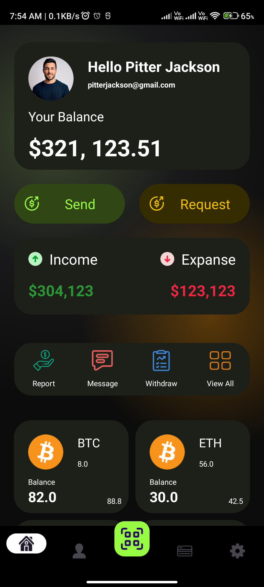

# CryptoCraze
CryptoCraze UI! Dive into the sleek and user-friendly interface designed to elevate your crypto management experience. Explore the intuitive dashboard, where you can track your assets, stay updated on market trends, and manage your digital portfolio effortlessly. Let's collaborate on GitHub and shape the future of crypto UI together!

| Intro Screen | Dashboard Screen |
|:---------:|:-------------:|
 |  |

## Features

- **Current Balance:** Instantly view your current cryptocurrency balance in a prominent section at the top of the dashboard for quick reference.
- **Send Money:** Easily initiate cryptocurrency transactions by accessing the 'Send Money' feature directly from the dashboard, streamlining the process.
- **Receive Money:** Conveniently generate cryptocurrency addresses and QR codes to receive funds from other users or wallets.
- **Income and Expense Tracking:**  Monitor your income and expenses related to cryptocurrency transactions with dedicated sections, providing insights into your financial activity.
- **Microservices Integration:** Seamlessly access microservices such as price alerts, market analysis tools, and portfolio performance trackers to enhance your crypto management experience.
- **Top Cryptocurrency Cards:** Stay updated on the top-performing cryptocurrencies with dynamically updating cards, displaying key information like price, market cap, and 24-hour percentage change.
